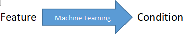

# sleepology

[](https://github.com/RichardLitt/standard-readme)


sleepology是一个使用Python开发的包，致力于开发一个可以管理、处理及采样巨大的睡眠多导图（PSG）数据集的Python包。并且它提供了用于机器学习、实时采样的功能。在未来会加入有关闭环刺激的功能。

目前项目在持续的开发阶段，仍不稳定。更新的版本间函数的功能和磁盘文件可能会有巨大的差异，且不提供向下兼容的接口。稳定版将会在`0.3`版本后提供。

所以目前并不建议您使用本包，若您真的希望使用，请保证在使用本包完成阶段性工作前不要更新它。与此同时作为作者，我也会尽可能将版本间的差异写明，如您在使用`0.2.x`版本时需要更新，请阅读完版本间的改变和差异。

作为一个新的完善的工具包，sleepology也会使用许多新的结构和新的概念，需要一定的学习成本。`Sleepology GUI`会在`0.4`版本后推出。

使用过程中有任何的问题，欢迎通过电子邮件联系或新开一个Issue。让我们一起完善这一工具。


## 内容目录

- [sleepology](#sleepology)
  * [内容目录](#----)
  * [背景](#--)
  * [安装](#--)
  * [使用说明](#----)
    + [了解数据集（Dataset）](#------dataset-)
      - [导入Dataset类](#--dataset-)
      - [创建数据集](#-----)
      - [读取数据集](#-----)
      - [保存数据集](#-----)
    + [从源（Source）导入数据](#---source-----)
      - [导入存储于磁盘的脑电数据](#------------)
      - [帧（epoch）](#--epoch-)
      - [导入来自日本光电机型的标签数据](#---------------)
      - [把源（Source）添加到数据集（Dataset）](#---source--------dataset-)
    + [特征、标签与条件](#--------)
      - [条件（Condition）](#---condition-)
      - [标签（Label）](#---label-)
    + [预处理](#---)
    + [数据探索](#----)
      - [统计条件（Condition）](#-----condition-)
      - [统计标签（Label）](#-----label-)
      - [可视化](#---)
    + [采样方案（Sample）](#-----sample-)
      - [如果您希望使用一个RNN网络（GRU、LSTM等）](#---------rnn---gru-lstm--)
  * [维护者](#---)
  * [如何贡献](#----)
  * [使用许可](#----)

## 背景

本项目始于**对睡眠多导图（PSG）数据进行机器学习的需求**。多导睡眠图作为特殊的人体生理数据，它的记录时长往往是一整晚，且具有多个电极导联。机器学习通常需要使用到多大量的多导睡眠图样本，对计算机的内存是极大的考验。

同时，进行睡眠研究的人员（哪怕是精通机器学习的人）通常没有大量的操作系统和计算机硬件知识。仅仅使用传统的机器学习工具包（如NumPy）也对数据的管理和重复使用产生巨大的考验，况且往往会因为内存问题而根本无法完成机器学习。

在sleepology的蓝图中，我们全部所希望实现的功能如下：

- 对批量PSG数据集的统一管理；
- 对预处理管道（Pipeline）的持久化；
- 对所有数据源（`Source`）的抽象；
- 对采样过程（`Sample`）的持久化；
- 对实时流的兼容和控制；
- 对实时刺激的兼容和控制。

**`sleepology.dataset`包**注重对批量的PSG数据进行导入、预处理、持久化（即保存到磁盘）过程进行优化，使您仅仅需要几行代码就可以有效管理巨大的数据集。通过`disk`模式，可以将所有的数据缓存在硬盘，仅仅在必要时使用内存，通过牺牲读写速度来避免OOM错误，使您可以不再受困于计算机性能限制。经目前的测试，在此模式下任何数据集都可以仅仅使用4G以内的内存。

`Dataset`支持对**多数据源、多标签**的数据的管理，您可以对您的数据帧（`epoch`）标记多个标签（`label`），例如这一帧同时表现了患者*“打鼾”*且处于*“NREM 1”*期。并简单地通过采样（`sample`）功能分别训练不同的标签分类，甚至多标签分类（multi-label classification，即由机器学习算法识别“打鼾且处于NREM-1期”的信号）。同时可以利用条件（`condition`）来对整段数据进行管理，例如此患者的*“诊断”*、*“性别”*等仅仅与整段数据（`data`）有关，而不属于数据帧（`epoch`）的特征。合理使用`Dataset`的各项功能，可以使您有效地管理数据集并与他人共享。


**`sleepology.sample`包**注重对`Dataset`的采样。使用相同方式进行预处理的`Dataset`，也可以以不同的形式进行采样——例如是由机器学习学习整段数据（`data`）和条件（`condition`）的对应关系、或是数据帧(`epoch`)和标签（`label`）的对应关系；也可以是对标签（`label`）进行筛选，仅仅学习某几类的对应关系。

`Sample`同时还包含**对数据进行探索、平衡和填充**的功能。在机器学习中，**不平衡**的数据集往往会使机器学习的结果有偏差，而多导睡眠图数据不像一般的神经科学实验能够被良好地提前设计，在数据采集阶段就达到不同类别的平衡。非平衡数据集是睡眠机器学习的所要面对的常态，所以`Sample`提供了多种函数对数据集进行平衡、填充，以确保训练的结果与样本分布无关且能够泛化。睡眠数据也往往**不等长**，因为我们无法控制患者整晚的睡眠时长，对于整段数据（`data`）的时间序列研究，许多模型要求输入数据的形状相同，您可以使用填充功能将所有数据填充至相同长度，并使用您惯用的机器学习包内诸如`Masking`这样的函数在训练时将填充的值滤除。


## 安装

本项目是一个Python包。在任意已安装Python 3.5以上版本并正确联网的计算机上使用如下命令完成安装。

```shell
$ pip install sleepology
```


## 使用说明

### 了解数据集（Dataset）

由于脑电信号——尤其是睡眠多导图数据——都是由特殊的文件格式（如`.edf`）存储的。一段脑电信号通常会包含许多不同的**标记（marker）**或在机器学习中我们称为**标签（label）**。当脑电信号被用于机器学习时，我们通常会根据marker切分片段，并将数值存储为`.csv`等格式。

在数据量小的情况下，这么做是很方便的。但是当面对一个庞大的数据——比如睡眠多导图数据时，这么做无疑会使得磁盘因为存放了太多文件而运行缓慢。不仅如此，由于许多生理数据集拥有多元标签维度*（比如这段脑电来自于男性还是女性？他/她被分进了哪一个实验组？这段脑电代表呈现给他/她什么刺激条件？）*，还有多种多样的数据处理方式，使得原先的脑电数据集存储方式无法继续使用。

**`sleepology.dataset.Dataset()`类是一种专门用于管理睡眠多导数据集的工具。**在`0.2`版本后，它已经开始支持对多元的数据集进行管理，并能够支持**超大数据集**。

#### 导入Dataset类

```python
from sleepology.dataset import Dataset
```


#### 创建数据集

```python
dataset = Dataset('example_name', 'example/path', '这里写这个数据集的注释。这是个示例数据集。')
```

使用Python创建对象的语句，可以创建一个`Dataset()`实例。

创建`Dataset()`的参数有这些：

> ```python
> Dataset(dataset_name,
>         save_path,
>         comment = '',
>         label_dict = os.path.join(package_root, 'labeltemplate', 'aasm.labeltemplate'),
>         mode = 'memory')
> ```
>
> `dataset_name`：`str` 数据集的名字，也会作为保存数据集时的文件名
>
> `save_path`：`path-like` 保存数据集的路径
>
> `comment`：`str` 用来描述你的数据集，方便未来查找
>
> `label_dict`：`path-like`一个用来管理标签的字典，会把人类所能理解的标签和用于机器学习的标签（比如one-hot）进行互相转换，默认是使用AASM标准的标签
>
> `mode`：`{'memory', 'disk'}` 选择内存模式（memory）还是磁盘模式（disk）。内存模式（memory）处理数据会更快，但是如果你的数据集特别大，超过内存（对于睡眠数据集来说是很容易这样的），那么使用磁盘模式（disk）可以把数据全部缓存在磁盘，直到真的需要用到它的时候才读取出来。默认是使用内存模式（memory）。

所以，如果你具有一个非常大的数据集，创建它的时候就使用：

```python
dataset = Dataset('example_name', 'example/path', '这里写这个数据集的注释。这是个示例数据集。', mode='disk')
```


#### 读取数据集

如果你不是从头创建，而是要读取之前存在磁盘的数据集，就要使用`Dataset.load()`：

```python
dataset = Dataset.load('example/path/example_name.dataset')
```

同样，如果你的数据集非常大，那么在读取的时候也要使用`'disk'`模式：

```python
dataset = Dataset.load('example/path/example_name.dataset', mode = 'disk')
```


#### 保存数据集

在我们整理好一个满意的数据集之后，我们一般不会只对它做一次实验。所以我们需要将它保存到磁盘，以备日后再用。由于在创建数据集的时候已经指定了数据集的名字和存储路径，所以可以直接使用：

```python
dataset.save()
```

如果想要换一个存储位置（相当于“另存为”），也可以使用：

```python
dataset.save('newpath/newname.dataset')
```


在了解了最基本的数据集创建、读取和保存之后，我们先不再继续学习数据集。转而看一看`source`模块如何帮助我们导入数据。


### 从源（Source）导入数据

我们学会了如何创建一个空的数据集，但是数据集一定需要有新的数据。为了统一数据输入的接口，我编写了`source`模块。

`sleepology.source`模块是对于脑电数据、睡眠多导数据以及其标签来源的一个处理模块。无论你的数据是`.edf`、`.eeg`、`.csv`或是来自局域网实时的数据流，对于`sleepology`来说它们都是一种`Source`，可以用统一的方法导入。

由于`source`模块会在`0.3`版本进一步完善，目前仅仅实现了一部分功能。

#### 导入存储于磁盘的脑电数据

`RawDataFile`是`Source`的子类，专门用于读取存在于磁盘的脑电文件。

其能够支持如下格式：

- BrainVision (vhdr)
- European data format (edf)
- BioSemi data format (bdf)
- General data format (gdf)
- Neuroscan CNT data format (cnt)
- EGI simple binary (egi)
- EGI MFF (mff)
- EEGLAB set files (set)
- Nicolet (data)
- eXimia EEG data (nxe)

首先导入`RawDataFile`

```python
from sleepology.source import RawDataFile
```

然后创建一个新的`Source`：

```pyhton
raw = RawDataFile('example_path/example.edf', 'edf', 30, 100)
```

这里输入的参数，分别为：

- 目标文件的路径
- 目标文件的类型（输入后缀即可）
- 你所希望的**帧**大小（例子中是30秒为一帧）
- 你所希望的采样率

#### 帧（epoch）

由于`sleepology`是专门针对超大数据集开发的Python包，且能够兼容实时输入，所以设计成会一帧一帧地读取数据，并且一帧一帧地处理。

在AASM的标准包括更老的R&K标准中，睡眠数据也是按帧进行判读，每一帧为30秒。所以实际上数据集的标签（Label）也是按帧划分的。

`Source`类被设计成一个迭代器（Iterator），每次处理一帧数据。在创建`Source`的时候指定一个帧的大小是十分必要的。一般来说帧的大小根据标签的间隔来定，如果是睡眠数据的话，一般也是30秒。

#### 导入来自日本光电机型的标签数据

由于在开发`sleepology`时，我正在处理采集自日本光电睡眠多导仪的标签数据，所以目前只写了适配该机型的标签源（Source）。

```python
from sleepology.source import NihonkohdenLabelSource

label = NihonkohdenLabelSource('example_path/example.txt', 'aasm')
```

这里输入的参数，分别为：

- 目标文件的路径
- 目标文件的类型（是一个AASM的标签）

#### 把源（Source）添加到数据集（Dataset）

至此，我们已经有了一个数据，和一个匹配的标签文件，它们的变量名分别为`raw`和`label`。同时还有一个空数据集`Dataset`。

我们使用：

```python
dataset.add_data(raw, label)
```

把源添加到数据集。


**当然，数据集肯定不止有一个数据。**我们通常会使用相似的文件名来匹配脑电数据和他们的标签，所以一般我们使用一个循环来添加数据：

```python
import glob
from sleepology.source import RawDataFile
from sleepology.source import NihonkohdenLabelSource

dataset = Dataset('example', 'data/', '保留各导联原始数据，只做滤波的数据集。')

# 使用glob匹配所有的文件，*表示省略，只要文件名满足*前后的格式，都能一次性匹配
raws = sorted(glob.glob('/home/zhaokuangshi/data/CleanData/raw/*.edf'))
labels = sorted(glob.glob('/home/zhaokuangshi/data/CleanData/label/*.txt'))

# 循环把所有的数据添加进Dataset
for i in range(len(raws)):
    f = RawDataFile(raws[i], 'edf', 30, 100) 
    l = NihonkohdenLabelSource(labels[i], 'aasm')
    dataset.add_data(f,l) # 注意这里脑电数据和标签文件一定要配对！不要配错标签
```


这样，我们仅仅用10行左右的代码，就可以把所有的数据归集到一起，方便我们处理。


### 特征、标签与条件

在有监督学习中，我们通常采取把特征（Feature）利用机器学习的方法拟合至标签（Label）。而在另一个尺度上，`Feature`常常来自于不同的`Data`，比如我们采用了来自许多人的睡眠多导数据来训练一个能够泛化的模型，那么每个`Data`的`Condition`也具有它的意义。利用sleepology管理数据集，最重要的就是管理一组一组的特征和标签的对应关系以及数据和条件的关系。**只需要记住，Feature、Label和Condition是Dataset包十分重要的概念。**

- 每一帧的特征（Feature），和标签（Label）有对应关系。比如清醒情况下的脑电、和昏迷情况下的脑电。可以使用机器学习训练来学习这种关系：


- 每一个数据（Data），和条件（Condition）有对应关系。比如癫痫患者的脑电和健康人的脑电。这种区别不仅仅体现在一个epoch中，更可能体现在整个数据中。同时，癫痫患者也会有情形情况和昏迷情况，所以`Condition`是对整个数据的更笼统描述：


- 当然，我们也可以利用机器学习来学习每帧（epoch）的特征（Feature）和数据的条件（Condition）有什么对应关系。比如，同样在清醒状态下，健康人和癫痫患者的脑电能不能通过机器学习来分辨呢？



`sleepology`提供了所有这些你想要的学习模式的解决方案。你所需要做的就是记住这几个单词所表示的意思。为了方便理解，还可以参考下图：


当然，也存在不需要标签（Label）的情况。比如一个用来预测（predict）而不是用来训练（train）的数据集，本身就不具有标签。此外，如果您想要做**自编码器**的训练，那么也仅仅需要输入特征即可。


**大部分情况下，您不需要手动地把数据赋值给feature或者label，这将在您使用预处理的时候自动完成。但您必须清楚您数据中的feature、label和condition分别是什么，以方便您的训练。**


#### 条件（Condition）

您可以这样设定一个条件：

```python
dataset.set_condition('002.edf', 'diagnose', 'A')  # 将002.edf这个数据的'diagnose'这一条件的值设为'A'
```

条件可以有许许多多的种类。 您不能否认，性别、年龄、身高、疾病、您所划分的实验组别，都可以作为条件（Condition）。所以`sleepology`的条件（Condition）结构是：

```
(condition_type, condition_label)
```

当您想要获取一个数据（Data）的条件（Condition）时：

```python
dataset.get_condition('002.edf', 'diagnose')
```

查询是否存在条件（Condition）：

```python
dataset.has_condition('002.edf', 'diagnose')
```

删除一个条件（Condition）：

```python
dataset.del_condition('002.edf', 'diagnose')
```


如果只能增删改查，体现不出条件（Condition）的作用。其实您还可以根据条件（Condition）选择数据（Data）：

```python
dataset.select_data('diagnose', 'A')
```

或者根据条件（Condition）从数据集中删除数据（Data）：

```python
dataset.exclude_data('diagnose', 'A')
```

甚至根据条件（Condition）选择帧（Epochs）：

```python
dataset.select_epochs('diagnose', 'A')
```


合理利用这些函数，可以帮助您采用更多方法分析、处理您的数据。


#### 标签（Label）

和条件（Condition）不同，标签（Label）不能手动设定。因为标签的数量实在是太庞大了，几乎不可能通过手动的方式设定，所以设定标签的函数被定义为一个私有方法，它们通常是在预处理的时候自动设定的。

标签（Label）也可以有许许多多的种类。比如在睡眠过程中，人的氧饱和度（低、中、高）、睡眠的阶段（N1、N2、N3、REM）、是否打鼾等等都可以作为标签。所以`sleepology`的标签（Label）结构是：

```
(label_name, label_value)
```

默认的`label_name`是`'LABEL'`。

当您想要获取一个帧（Epoch）的标签（Label）时：

```python
dataset.get_label('002.edf', 1, 'LABEL')  # 1是帧（epoch）的序号，代表我获取帧1
```

删除一个标签（Label）：

```python
dataset.del_label('LABEL')
```

删除标签不能只针对一帧进行删除，因为这样会导致后续采样、机器学习时候报错。您想要删除标签是因为您觉得**这一类标签都不重要**，而不是针对这一个标签。如果您是不想要标有这几个标签的帧，请使用`exclude_epochs`函数。下方就有介绍。


```python
dataset.select_epochs('LABEL', '1')
```

或者根据条件（Condition）从数据集中删除数据（Data）：

```python
dataset.exclude_epochs('LABEL', '1')
```

但是我们无法利用标签（Label）来对整个数据（Data）做操作。如果您不了解它们的结构，请回到本节开头阅读。

合理利用这些函数，可以帮助您采用更多方法分析、处理您的数据。


### 预处理

对脑电信号的预处理，主要是类似于**滤波**、**重采样**、**时频变换**等操作。但是由于sleepology是开发用于长时间的睡眠监测任务的，所以所有的预处理仅仅针对于**帧（epoch）**。

对于脑电信号来说，如果你有足够长的数据进行滤波，会比相对短的数据进行滤波取得更好的效果，因为它能够减少旁瓣泄露。对于睡眠数据来说，30秒长度的一帧已经足够长，旁瓣泄露的影响相对很小了。如果您采用别的数据并在`Source`初始化时设定了很小的`epoch_length`，请谨慎了解过短的信号对于预处理可能造成的影响。


预处理首先需要设定一个预处理的管线（Pipeline）。所谓的管线，就是一套序列流程，序列的入口是你输入的数据，而出口是预处理完的数据。需要用到一个高阶函数。如下面的例子：

```python
def preprocess():  # 您需要首先定义一个函数，函数名无所谓，输入什么参数也都无所谓。这是一个高阶函数，因为它内部还有一个函数。
    def pipeline(data):  # 在内部再定义一个函数，函数名无所谓，推荐您使用pipeline。请注意，这个函数名必须和最后一行的return返回的内容同名。
        				 # 这个函数的输入参数是data，即你的feature原始数据。数据类型是`mne.Epochs`
        # 这里开始写你的预处理操作
        try:
            data.load_data()
            data.filter(0.3, 35, picks = ['C3-A2', 'C4-A1', 'O1-A2', 'O2-A1', 'EOG-L', 'EOG-R'])
            data.filter(10, None, picks = ['Chin', 'LEG', 'Snore'])
            data.filter(0.3, None, picks = ['ECG']) 
            data.resample(20)
            data = data.get_data(
                picks = ['C3-A2', 'C4-A1', 'O1-A2', 'O2-A1', 'EOG-L', 
                     'EOG-R', 'Chin', 'ECG', 'LEG', 'Snore']
            )
            ret = normalize(data, axis = -1)
        finally:
            del data
        return ret  # 将预处理完的数据输出
    return pipeline  # 将您定义的pipeline返回
```

上面是一个对原始数据进行滤波的操作。您只需要对输入的`data`进行一系列预处理操作，操作所使用的函数详见https://mne.tools/stable/generated/mne.Epochs.html#mne.Epochs 。请注意上述代码的注释所提醒的，您需要嵌套地定义两层函数，并有两个`return`语句。内部的`return`将处理完以后的数据输出，外部的`return`将内部的**函数**输出。所以外部的return就是内部的函数名。

随后您需要利用`Procedure`类来管理管线。具体操作是：

```python
from sleepology.procedure import Procedure


procedure = Procedure(preprocess)  # 创建一个新的procedure，输入参数就是前面定义的管线函数preprocess。如果您用了其他的函数名，就把其他函数名输入即可。
```

完成了这些，就可以开始预处理了。使用

```py
dataset.preprocess(procedure)
```

所有数据都会依次预处理。如果数据量比较大的话，您需要等待一些时间。

**在大量的数据集中，难免会数据损坏的、不符合要求的数据集，会导致运行报错。但是`Dataset.preprocess()`函数不会直接报错，而会将具体的错误记录在一个文本文档中，并跳过错误的区域继续处理后续数据。如果所有的数据全部报错，很可能是您的`Procedure`预处理流程本身设定有错误，那么程序会在完成了所有的预处理步骤后进行再次检查，如果发现所有的数据全部出错，才会产生报错信息提示您检查预处理流程。**

建议您完成预处理后打开日志文档进行查看，了解自己的哪些数据集存在错误。


**总结一下预处理的步骤：**

1. 定义一个用于预处理的高阶函数
2. 创建一个`Procedure()`类，输入您创建的高阶函数
3. 使用`dataset.preprocess(procedure)`，就开始预处理
4. 完成预处理后，查看错误日志、
5. 别忘了保存你的数据集`dataset.save()`


### 数据探索

在面对全新的数据集时，你必须提前进行数据探索，把握数据的特征。`sleepology.Dataset`提供了如下一些函数进行数据探索。

#### 统计条件（Condition）

```python
stat = dataset.stat_condition('diagnose')  # 传入condition_type
```

可以得到一个dict形式的返回，显示每一种diagnose有多少个数据。

#### 统计标签（Label）

```python
stat = dataset.stat_label('LABEL')  # 传入label_name
```

可以得到一个dict形式的返回，显示每一种diagnose有多少个数据。

#### 可视化

```python
dataset.stat_plot_bar(stat)  # 传入前面的统计结果，绘制条形图
dataset.stat_plot_pie(stat)  # 传入前面的统计结果，绘制饼图
```


### 采样方案（Sample）

在整理完全部的数据以后，我们就要利用这些数据进行机器学习了。但是机器学习并不只是把全部的数据一股脑输入到模型，还需要做很多有意义的步骤。`sleepology.sample.Sample()`就是专门用于采样的工具。

本部分我们将使用几个案例来说明采样，而不逐个参数进行分析。


#### 如果您希望使用一个RNN网络（GRU、LSTM等）

对于睡眠多导图这样的一维时间序列模型，想要使用LSTM等模型是十分显然的选择。这时候您的输入就涉及到时间步（timestep）的信息了。如何根据时间步来采样信息呢？请看下面的例程。


这个例程体现了一个实验：希望用10个时间步（timestep）长度的数据，通过睡眠时的脑电来进行睡眠阶段分期。实验使用10折交叉验证。

数据集中，特征（Feature）存在`'FEATURE'`中（这是一个`feature_name`），而标签（Label）存在`'LABEL'`中。

```python
# 假设您的磁盘上有一个已经预处理完成的dataset文件。我们直接导入即可。
from sleepology.dataset import Dataset
from sleepology.sample import Sample

# 导入数据集
dataset = Dataset.load('example.dataset')

# 新建一个采样方案
sample = Sample(
			 unit='epoch',  # 我们希望用每一个epoch的特征和标签进行训练，而不是用全部一整个数据的所有信息
    		 tmin=-5,  # 我们希望在每个epoch采样时，同时采样它前面5个时间步（timestep）的信息
    		 tmax=4,  # 我们希望在每个epoch采样时，同时采样它后面4个时间步（timestep）的信息
    		 n_splits=10,  # 我们希望进行10折交叉验证
    		 class_balance=True,  # 我们希望对不同类别的标签进行平衡
    		 test_size=0.1,  # 我们希望每次抽样，都随机划分10%的数据用以验证
		)

# 设定模型的输入输出
sample.set_x('FEATURE')  # 我们用'FEATURE'作为实验模型的输入
sample.set_y('LABEL')  # 我们用'LABEL'作为实验模型的输出

# 至此，我们已经完成了采样方案的设定，希望利用该采样方案从dataset中采样
sample.from_dataset(dataset)

# 我们也可以保存这一种采样方案
sample.save('score.sample')
```

采样方案和数据集是互相独立的。我们可以用不同的采样方案对数据集进行采样，也可以用同一套采样方案去采样不同的数据集。当拥有了一套绝佳的预处理、采样、模型方案时，我们可以利用这些部件很轻松地搭建出一套完整的监测系统。


随后，当您需要使用这些采样数据时

```python
import tensorflow as tf

# 省略建模过程
...

# 每一折交叉验证，都要用到sample.next_fold()。这样数据会重新随机化，选出新的10%的验证集
for i in range(10):
    sample.next_fold()  # 初始化新的一折数据
    # 随后可以利用sample.train_set和sample.test_set来使用训练集和测试集
    # 数据集类别平衡、时间序列采样等步骤都已经自动完成了
    train = tf.data.Dataset.from_generator(sample.train_set, (tf.float32, tf.int32))
	test = tf.data.Dataset.from_generator(sample.test_set, (tf.float32, tf.int32))
    history = model.fit(train, validation_data = test)
```


## 维护者

[@Zhao-Kuangshi](https://github.com/Zhao-Kuangshi)


## 如何贡献

您可以新建一个Issue反应问题，也十分欢迎您Fork本项目并Pull request。


## 使用许可

GPL 3.0